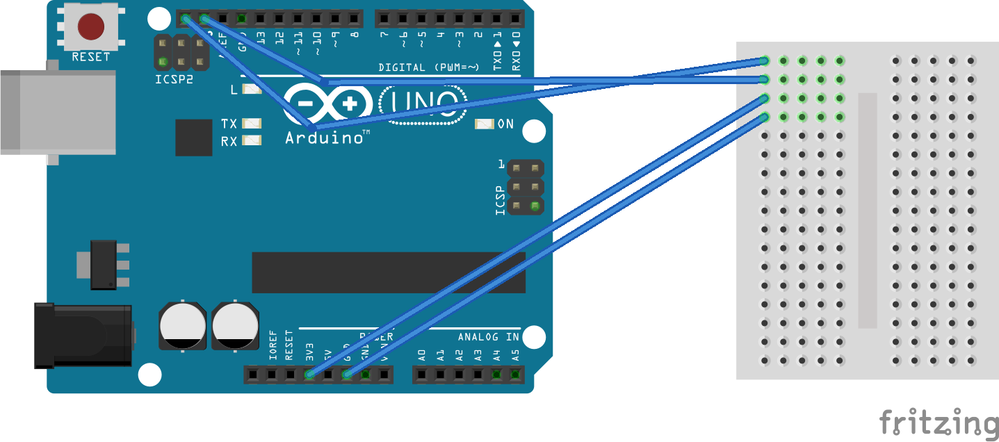
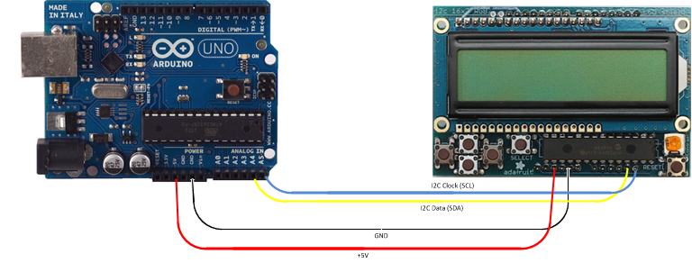

# Hardware Setup Guide

This page will show take you through the steps of setting up the necessary hardware for the various components of the sensor system.

## 1. Headless Arduino Sensor

The Headless Arduino Sensor is meant to be placed out in fields for extended periods of time and takes 
measurements in predetermined intervals.
No user interaction is required to run one of these units. As soon as it turns on, it will start to take 
measurements and will keep taking
measurements until the system is shut off.

To build this, we need the following materials:

* nRF24l01+ RF radio transmitter  - [link](https://www.aliexpress.com/item/Smart-Electronics-1Set-2-4G-1100-Meters-Long-Distance-NRF24L01-PA-LNA-Wireless-Transceiver-Communication-Modules/32707423150.html?spm=2114.search0104.3.1.2f3679daNLhNiN&ws_ab_test=searchweb0_0,searchweb201602_1_10065_10068_204_10130_318_10547_10546_10059_10884_10548_10545_10887_10696_100031_10084_10083_10103_10618_452_10307_532,searchweb201603_60,ppcSwitch_0&algo_expid=3c7fee1b-fa24-4b2b-a946-42887456755f-0&algo_pvid=3c7fee1b-fa24-4b2b-a946-42887456755f&transAbTest=ae803_5&priceBeautifyAB=0)
* Arduino Uno Rev 3 - [link](https://www.aliexpress.com/item/Smart-Electronics-1Set-2-4G-1100-Meters-Long-Distance-NRF24L01-PA-LNA-Wireless-Transceiver-Communication-Modules/32707423150.html?spm=2114.search0104.3.1.2f3679daNLhNiN&ws_ab_test=searchweb0_0,searchweb201602_1_10065_10068_204_10130_318_10547_10546_10059_10884_10548_10545_10887_10696_100031_10084_10083_10103_10618_452_10307_532,searchweb201603_60,ppcSwitch_0&algo_expid=3c7fee1b-fa24-4b2b-a946-42887456755f-0&algo_pvid=3c7fee1b-fa24-4b2b-a946-42887456755f&transAbTest=ae803_5&priceBeautifyAB=0)
* MLX90614 Infrared Sensor - [link](https://www.aliexpress.com/item/GY-906-MLX90614ESF-New-MLX90614-Contactless-Temperature-Sensor-Module-For-Arduino-Compatible/32739146147.html?spm=2114.search0104.3.2.699934faknjlBa&ws_ab_test=searchweb0_0,searchweb201602_1_10065_10068_204_10130_318_10547_10546_10059_10884_10548_10545_10887_10696_100031_10084_10083_10103_10618_452_10307_532,searchweb201603_60,ppcSwitch_0&algo_expid=b6f632e5-2b26-40f9-8b8c-7be8477b249a-0&algo_pvid=b6f632e5-2b26-40f9-8b8c-7be8477b249a&transAbTest=ae803_5&priceBeautifyAB=0)
* TSL2561 Light Sensor - [link](https://www.adafruit.com/product/439?gclid=Cj0KCQjw9NbdBRCwARIsAPLsnFZvBKCgYZUCkA_8lXJjnvWD5JT4TLO_xhLZNdWYmtnD803pbOtHs5oaAqeMEALw_wcB)
* Mini breadboard - [link](https://www.aliexpress.com/item/SYB-170-Mini-Solderless-Prototype-Experiment-Test-Breadboard-170-Tie-points-35-47-8-5mm-for/32902041277.html?spm=2114.search0104.3.25.51fd3b3cxxuOZY&ws_ab_test=searchweb0_0,searchweb201602_1_10065_10068_204_10130_318_10547_10546_10059_10884_10548_10545_10887_10696_100031_10084_10083_10103_10618_452_10307_532,searchweb201603_60,ppcSwitch_0&algo_expid=3d998bfd-504e-4784-a5b7-4aeccdad269d-4&algo_pvid=3d998bfd-504e-4784-a5b7-4aeccdad269d&transAbTest=ae803_5&priceBeautifyAB=0)
* Jumper wires - [link](https://www.aliexpress.com/item/40PIN-Dupont-Line-10CM-20CM-30CM-Male-to-Male-Female-to-Male-and-Female-to-Female/32891879068.html?spm=2114.search0104.3.3.239c5d1blxjypN&ws_ab_test=searchweb0_0,searchweb201602_1_10065_10068_204_10130_318_10547_10546_10059_10884_10548_10545_10887_10696_100031_10084_10083_10103_10618_452_10307_532,searchweb201603_60,ppcSwitch_0&algo_expid=c2e4534a-53a7-4d3e-b113-b54305d2db65-0&algo_pvid=c2e4534a-53a7-4d3e-b113-b54305d2db65&transAbTest=ae803_5&priceBeautifyAB=0)
* A standard portable battery (can be found at most department stores)

First start by connecting the mini breadboard to the Arduino. The mini breadboard will be used to wire out 
the i2c pins to the MLX90614 and the TSL2561. The breadboard should be wired to the arduino as shown below:

the pin farthest to the left on the top side is the SCL pin, and the second to left is the SDA pin. The 
pins on the bottom side are for voltage in and ground.

As you can see, each row on the breadboard has 5 possible inputs for wires. These can be used to wire 
parts in parallel and have a single pin on the arduino going out to multiple devices. The MLX90614 and the 
TSL2561 both have 4 pins corresponding to the 4 pins wired from the arduino. Insert 4 more wires in their 
respective rows in the breadboard and wire these out to the 3v3, gnd, scl and sda pins on the two sensors.

For setting up the nRF24l01+ radio, we will be using the SPI protocol pins on the Arduino uno. Each pin on
the nrf24l01+ should have a label showing which type of pin it is. Some of the pins will be placed in the 
breadboard we set up, and some will be placed directly in the Arduino. The wiring should be as follows:

| Arduino   | RF24                  |
| --------- | --------------------- |
| GND       | GND pin on breadboard |
| VCC       | 3v3 row on breadboard |
| CE        | pin 7                 |
| CSN       | pin 8                 |
| SCK       | pin 13                |
| MOSI      | pin 11                |
| MISO      | pin 12                |

IMPORTANT NOTE: The nrf24l01+ module tends to have issues with packet loss and poor connection. In order 
to fix this, you will need to solder a 10µF capacitor between the VCC and GND pins on the top of the 
module. Make sure that the wire on the side of the capacitor with the white stripe is attached to GND, or 
the capacitor will not work. This should fix connectivity issues.

That should be all you need to get the sensor running! Make sure to read carefully and wire the hardware
into the correct ports, as not completing this step correctly will cause your sensors to not function 
properly.

## 2. Arduino Sensor With LCD Screen

The next variant of the Arduino Sensor has an LCD screen attached to it for user interface. In order to 
build one of these devices, you will need all of the equipment mentioned in part 1, as well as the 
Adafruit RBG LCD Shield, which can be found on [the Adafruit website](https://www.adafruit.com/product/716?gclid=Cj0KCQjw9NbdBRCwARIsAPLsnFbOT5jcvIcDLZFVWoXwM5iaKDnkthy47sqNqfPDBeItbKNIVU-LKlYaArxmEALw_wcB)

To build one of these units, first follow all the steps in part 1 of this tutorial. After that, the only
thing left to do is to wire the LCD screen component. Wiring is fairly simple and should be done as outlined in this image:

Once that's done, you should be good to go!

## 3. Raspberry Pi Sensor with Screen

This unit is functionally the same as the arduino sensor, but is built using a raspberry pi. Wiring is the 
same as in parts 1 and 2, but the layout of the pins on the raspberry pi is different. Here's a diagram of 
the Raspberry Pi 3 GPIO pin layout

The breadboard should be wired to the following pins:

| Name  | Pin          |
| ----- | ------------ |
| 3v3   | Pin 1 (3.3V) |
| GND   | Pin 9 (GND)  |
| SDA   | Pin 3 (GPIO2)|
| SCL   | Pin 5 (GPIO3)|

The nRF24l01+ Should be wired to the following;

| Name | Pin            |
| ---- | -------------- |
| VCC  | Pin 17 (3.3V)  |
| GND  | Pin 25 (GND)   |
| MOSI | Pin 19 (GPIO10)|
| MISO | Pin 21 (GPIO9) |
| SCK  | Pin 23 (GPIO11)|
| CE   | Pin 22 (GPIO25)|
| CSN  | Pin 24 (GPIO8) |

The LCD screen should be wired as follows:

| Name | Pin               |
| ---- | ----------------- |
| VIN  | Pin 2 (5V)        |
| GND  | Pin 6 (GND)       |
| SDA  | SDA on breadboard |
| SCL  | SCL on breadboard |

That should be all you need to get the hardware set up for the Raspberry Pi Sensor!

## 4. Raspberry Pi Hub

The hub is the most important part of the entire sensor network, and will be receiving input from the 
sensors over RF radio using the nRF24l01+ modules. The Sensors will send data the Hub and the hub will
record the data locally to csv files that can be viewed in Excel. The Hub will also upload the files to
Dropbox on command over 3G and Wifi connections.

The Hub will need a few different components than the sensor. These are as follows:

* nRF24l01+ radio (link above)
* DIYmall 3G shield [link](https://www.amazon.com/DIYmall-Raspberry-Expansion-SIM5320A-American/dp/B06Y3N1BD6)
* DS1307 Real Time Clock [link](https://www.adafruit.com/product/3296?gclid=Cj0KCQjw9NbdBRCwARIsAPLsnFado2th5VEzJcwWAEGqiO2NRMH_QnSaDjVPJlBi3pZGcAvTGn1hkJsaAi6KEALw_wcB)

The DIYmall 3G shield is used for 3G connectivity, allowing the Hub to upload measurements while out in the
field. The Real Time Clock is necessary for accurate recording of date and time, as the Raspberry Pi does
not have a built in real time clock.

To use the DIYmall 3G shield, make sure you have a valid SIM card inserted into the back of the device. 
For our Hub at the Tree Fruit Research Center, we used one of the data plans provided by [Embedded Works](http://www.embeddedworks.net/).
For future tutorials on setting up the software for the Raspberry Pi, we will be assuming that you are 
using one of these SIM cards.

After the SIM card is placed into the Shield, place the shield on top of raspberry pi, aligning all of the
holes in the bottom with the gpio pins on the device. Be careful not to apply to much pressure so the gpio pins don't bend. After this is done, the rest of the devices can just be placed on top of the shield like they would on the Raspberry Pi Sensor.

The real time clock requires a standard CR1220 coin cell battery. These can be found at department stores
and various online retailers. To wire the real time clock, wire the 5v pin to the 5v used by the lcd 
screen in part 3, and the GND, SDA, and SCL pins to the matching pins used for the breadboard in part 3.

The RF24 radio should be wired exactly the same as it was in part 3.

This should be all you need to set up the Hub.

Now that you know how to set up the hardware for all 4 devices, you should be good to go! Next we will 
cover how to configure the raspberry pi's so that we can install and setup the necessary software.

[Next: Configuring the Raspberry Pis](./Configuring-the-Raspberry-Pis.md)